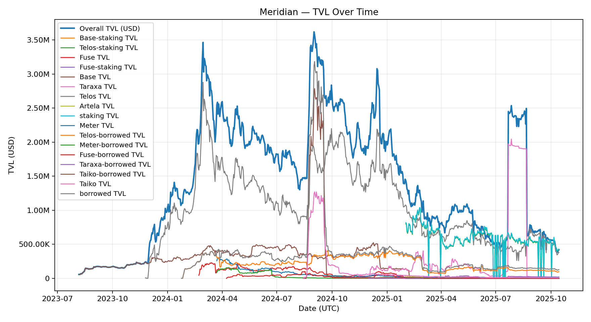

# Meridian TVL Report by Chain
**Report Date:** October 14, 2025
**Total Protocol TVL:** $420,809

## Executive Summary

Meridian currently maintains TVL across six active chains, with Telos representing the dominant deployment at over 90% of total protocol TVL. The data reveals a clear correlation between sustained incentive programs and TVL retention, with significant differences in performance between incentivized and organic deployments.

## Chain Performance Breakdown

### Telos - Peak: $2,879,597 (February 2024)
**Launch:** November 2023
**Incentive Strategy:** Sustained 2-year incentives program
**Current TVL:** $381,792 (13.3% retention from peak)

Telos represents Meridian's flagship deployment with the strongest performance metrics:
- Reached $1M TVL by January 6, 2024 (just 37 days after launch)
- Peaked at $2.88M in February 2024
- Maintained elevated TVL throughout 2024-2025 despite market decline
- Current retention of 13.3% is highest among all chains
- Additional $99,016 in borrowed assets shows healthy lending activity

The sustained incentives program on Telos has proven highly effective, creating both initial traction and long-term stability. While TVL has declined from peak, Telos maintains the best retention rate and demonstrates the value of consistent, long-duration incentive programs.

### Taraxa - Peak: $2,046,017 (July 2025)
**Launch:** December 2024
**Incentive Strategy:** No incentives
**Current TVL:** $13,039 (0.6% retention from peak)

Despite launching without any incentive program, Taraxa achieved remarkable organic growth:
- Reached $1M TVL by July 2025
- Peaked at $2.05M in late July 2025
- Sharp decline to current $13,039 (99.4% decrease from peak)
- $21,077 in borrowed assets indicates some continued lending usage
- Demonstrates potential for organic growth but challenges with retention

This deployment shows that Meridian can attract significant organic users initially, but struggles to maintain TVL without sustained incentives. The dramatic peak and decline suggest short-term speculation or ecosystem-specific events rather than sticky liquidity.

### Taiko - Peak: $1,270,044 (September 2024)
**Launch:** August 2024
**Incentive Strategy:** 1-month program with $30k in incentives
**Current TVL:** $10,379 (0.8% retention from peak)

Taiko exemplifies the "incentive spike" pattern:
- Rapid initial growth, reaching $1M TVL by August 27, 2024 (7 days after launch)
- Peaked at $1.27M on September 2, 2024 (end of incentive period)
- Sharp decline post-incentive period to current $10,379 (99.2% decrease)
- Minimal borrowed assets ($4,888) suggest reduced activity
- Retention rate of 0.8% demonstrates mercenary capital behavior

The short-term incentive program successfully bootstrapped initial liquidity but failed to create sustainable TVL retention. Most liquidity departed immediately after rewards ended, highlighting the importance of incentive duration and alignment. The $30k investment generated temporary liquidity but minimal lasting value.

### Base - Peak: $524,951 (December 2024)
**Launch:** August 2023 (Meridian's first chain)
**Incentive Strategy:** Unknown (legacy deployment)
**Current TVL:** $5,995 (1.1% retention from peak)

As Meridian's original deployment on Base:
- Reached $250k milestone in December 2023
- Peaked at $525k in December 2024 (16 months after launch)
- Declined significantly to current $5,995 (98.9% decrease)
- Minimal current activity
- Likely superseded by Telos as the primary deployment

The delayed peak (16 months post-launch) and subsequent collapse suggest Base benefited from broader market conditions or ecosystem growth rather than Meridian-specific incentives. Current minimal TVL indicates the deployment has been deprioritized.

### Meter - Peak: $299,295 (March 2024)
**Launch:** March 2024
**Incentive Strategy:** No incentives
**Current TVL:** $6,100 (2.0% retention from peak)

Meter achieved impressive early growth without incentives:
- Reached $250k TVL on launch day (March 23, 2024)
- Peaked at $299k just 2 days later (March 25, 2024)
- Sharp decline to current $6,100 (98% decrease)
- $2,440 in borrowed assets
- Retention rate of 2.0% is slightly better than other non-incentivized chains

The rapid initial growth followed by sharp decline suggests Meter had organic community interest or launch hype that wasn't sustained. Without incentives to maintain engagement, users departed despite initial enthusiasm. Performs marginally better than Taiko/Taraxa in retention.

### Fuse - Peak: $230,363 (March 2024)
**Launch:** February 2024
**Incentive Strategy:** Short incentives program
**Current TVL:** $3,499 (1.5% retention from peak)

Fuse showed modest performance despite incentives:
- Reached $100k milestone within 24 hours of launch
- Peaked at $230k on March 14, 2024 (roughly 3 weeks after launch)
- Declined to current $3,499 (98.5% decrease)
- Minimal borrowed assets ($514)
- Retention rate of 1.5% falls between Taiko (0.8%) and Meter (2.0%)

The short incentive program on Fuse generated initial interest but proved insufficient for long-term retention. Performance is comparable to non-incentivized chains, suggesting short-term incentive programs may not justify their cost versus pure organic launches.

## Key Findings

1. **Sustained Incentives Drive Retention:** Telos achieved 13.3% retention from its $2.88M peak, vastly outperforming all other chains (0.6-2.0% retention). The 2-year sustained incentive program demonstrates clear superiority in maintaining TVL versus short-term approaches.

2. **Short-Term Incentives Fail to Retain Capital:** Taiko (1-month, $30k incentives) and Fuse (short program) achieved 0.8% and 1.5% retention respectively - comparable to non-incentivized chains. Short-term incentive programs may not justify their costs given minimal retention benefits.

3. **All Chains Experience Severe Drawdowns:** Every deployment lost 86-99% of peak TVL, suggesting broader market factors or fundamental protocol challenges beyond incentive design. Even Telos with sustained incentives retained only 13.3% from peak.

4. **Organic Growth Can Achieve Scale But Not Retention:** Taraxa peaked at $2.05M without incentives (comparable to Telos's $2.88M peak), demonstrating organic traction is possible. However, 0.6% retention shows that attracting users and keeping them are distinct challenges.

5. **Peak TVL Does Not Predict Retention:** Higher peaks don't guarantee better retention. Meter ($299k peak) retained 2.0% while Taiko ($1.27M peak) retained only 0.8%, suggesting capital quality matters more than quantity.

## Recommendations

Based on this analysis:

1. **Prioritize Long-Duration Incentives:** Future deployments should implement sustained incentive programs (12+ months minimum). Telos's 13.3% retention is 6-20x better than alternatives, clearly justifying the extended investment.

2. **Avoid Short-Term Incentive Programs:** Programs under 3 months show no meaningful retention advantage over organic launches (0.8-1.5% vs 0.6-2.0%). These campaigns attract mercenary capital and may not be cost-effective.

3. **Investigate Broader TVL Decline:** All chains lost 86-99% from peak, including well-incentivized Telos. This suggests protocol-wide or market-wide issues that transcend individual chain performance. Recommended: conduct user interviews and competitive analysis to understand the systematic decline.

4. **Focus on Capital Quality Over Quantity:** Peak TVL is a vanity metric. Taraxa achieved a $2M peak organically but retained only 0.6%, while Telos's sustained approach retained 13.3% despite broader market challenges. Design incentive programs that align with long-term users rather than maximize initial TVL.

5. **Consider Telos-Only Strategy:** With 90.7% of protocol TVL and 13x better retention than alternatives, consider concentrating resources on the Telos deployment rather than spreading efforts across underperforming chains.

---

**Data Source:** DeFi Llama API
**Generated:** 2025-10-14 09:59:55 UTC
